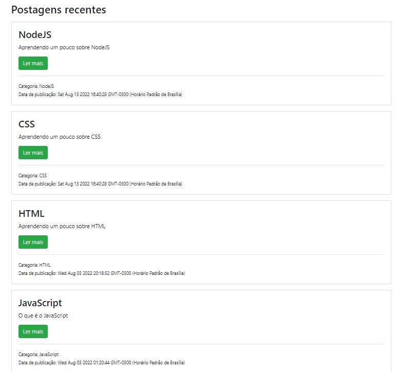

<h1 align="center">Blog StudentDev</h1>

# Readme

BLOG desenvolvido para fins de estudo.

<h4>Project in progress...</h4>

# Features
- [x] Criação e exclusão de usuarios;
- [x] Autenticação de usuarios;
- [x] Criação, leitura, edição e exclusão de Postagens e Categorias de postagens;
- [x] Rotas restritas à administradores;
- [x] Componentes e Helpers(Handlebars);
- [x] API;
- [x] Banco de dados(MongoDB);

<h1>
    
</h1>

<h1>
    
</h1>

<h1>
    
</h1>

<h1>
    
</h1>

<h1>
    
</h1>

# Prerequisites
To get started you need to have the [Git](https://git-scm.com/), NodeJS and MongoDB tools installed on your machine. You also need an editor to work with code like [VSCode](https://code.visualstudio.com/).

### Technologies
- HTML
- CSS
- JavaScript
- NodeJS
    - Express
        - express-handlebars
        - express-session
    - Passport
    - Body-parser
    - Mongoose
    - Bcryptjs
- Bootstrap
- MongoDB

---

Made by GUTEMBERG OLIVEIRA. - [See my linkedin.](https://www.linkedin.com/in/gutemberg-oliveira-61a1b1116/)
